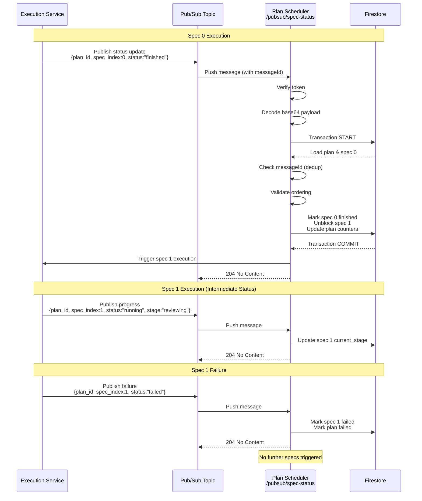
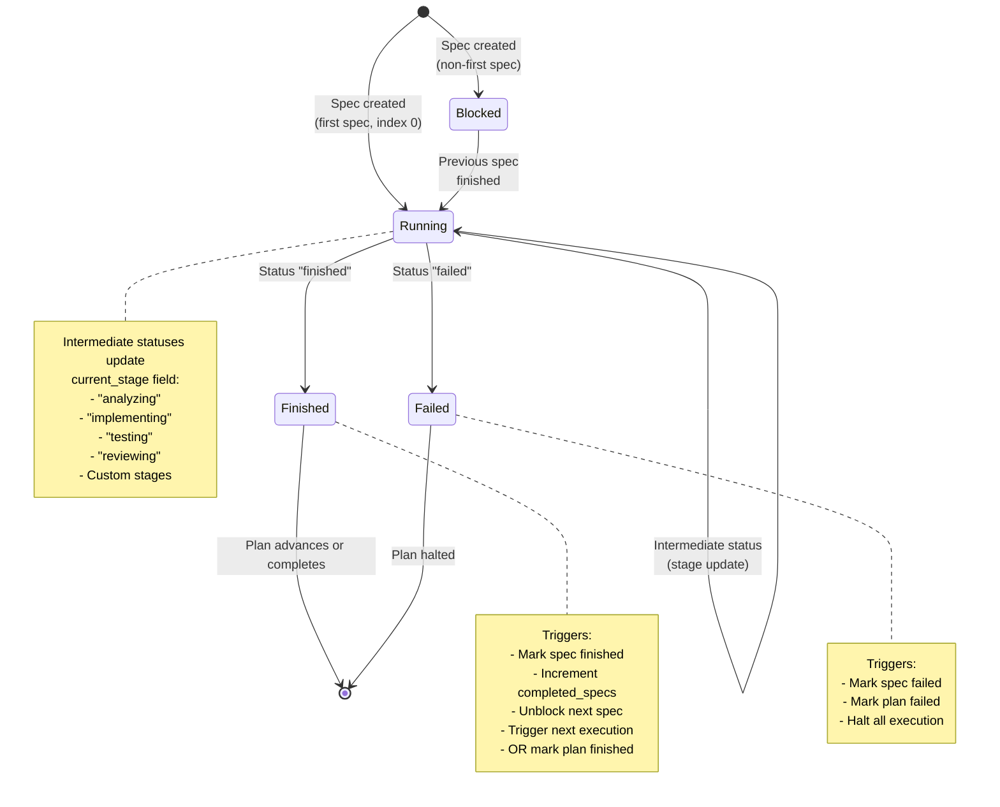

# Plan Scheduler Service

FastAPI service for plan scheduling with Firestore integration and Pub/Sub support.

## Features

- FastAPI web framework with automatic OpenAPI documentation
- JSON-structured logging for production observability
- Environment-based configuration with sensible defaults
- Health check endpoint for monitoring
- Firestore integration with credential-aware initialization
- Poetry for dependency management
- Comprehensive test coverage

## Prerequisites

- Python 3.12 or higher
- Poetry (for dependency management)
- GCP service account credentials (for Firestore/Pub/Sub access)

## Local Development Setup

### 1. Install Dependencies

```bash
# Install Poetry if not already installed
pip install poetry

# Install project dependencies
poetry install
```

### 2. Configure Environment Variables

Copy the example environment file and update with your values:

```bash
cp .env.example .env
```

Edit `.env` with your configuration:

- `FIRESTORE_PROJECT_ID`: Your GCP project ID (required for Firestore)
- `GOOGLE_APPLICATION_CREDENTIALS`: Path to your service account JSON key file
- `PORT`: Port to run the service (default: 8080)
- `SERVICE_NAME`: Service identifier for logging (default: plan-scheduler)
- `PUBSUB_VERIFICATION_TOKEN`: Token for Pub/Sub request verification

#### Setting up Google Cloud Authentication

The service uses **Application Default Credentials (ADC)** to authenticate with Firestore. Choose one of these methods:

**Option 1: Service Account Key (Recommended for production)**

1. Create a service account in GCP Console
2. Grant the service account the `Cloud Datastore User` role (or `Firestore Service Agent` for broader access)
3. Download the JSON key file
4. Set the path in your `.env` file:
   ```
   GOOGLE_APPLICATION_CREDENTIALS=/path/to/service-account-key.json
   ```

**Option 2: User Credentials (Local development only)**

```bash
gcloud auth application-default login
```

This creates credentials that your application can use locally without needing a service account key file.

#### Required Firestore Permissions

Your service account or user credentials need these permissions:
- `datastore.entities.create` - Create documents
- `datastore.entities.get` - Read documents
- `datastore.entities.delete` - Delete documents

These are included in the `Cloud Datastore User` role.

### 3. Run the Service

```bash
# Using Poetry
poetry run uvicorn app.main:app --host 0.0.0.0 --port 8080 --reload

# Or activate the virtual environment first
poetry shell
uvicorn app.main:app --host 0.0.0.0 --port 8080 --reload
```

The service will be available at:
- Main API: http://localhost:8080
- Health check: http://localhost:8080/health
- API documentation (Swagger UI): http://localhost:8080/docs
- API documentation (ReDoc): http://localhost:8080/redoc
- OpenAPI schema: http://localhost:8080/openapi.json

### 4. Run Tests

```bash
# Run all tests
poetry run pytest

# Run with coverage
poetry run pytest --cov=app --cov-report=term-missing

# Run specific test file
poetry run pytest tests/test_health.py

# Run with verbose output
poetry run pytest -v
```

## Makefile Commands

The project includes a Makefile for common development tasks. Run `make help` to see all available commands:

### Development Commands

```bash
# Install dependencies
make install

# Run tests
make test

# Run tests with coverage
make test-cov

# Run linter
make lint

# Format code
make format

# Check formatting without changes
make format-check

# Run service locally
make run

# Clean cache files
make clean
```

### Docker Commands

```bash
# Build Docker image
make docker-build

# Run Docker container (requires .env file)
make docker-run

# View container logs
make docker-logs

# Stop container
make docker-stop
```

### Pre-commit Hooks (Optional)

```bash
# Install pre-commit hooks
make pre-commit-install

# Run pre-commit on all files
make pre-commit-run
```

## Docker Usage

The service can be containerized and run with Docker, which is useful for local testing and Cloud Run deployment.

### Build Docker Image

```bash
# Using Makefile
make docker-build

# Or using Docker directly
docker build -t plan-scheduler:latest .
```

The Dockerfile:
- Uses multi-stage build for smaller final image
- Builder stage installs Poetry and exports dependencies to requirements.txt
- Final stage uses Python 3.12 slim base image
- Installs dependencies from requirements.txt (no Poetry in final image)
- Copies application code
- Exposes port 8080 (Cloud Run default)
- Runs uvicorn with Cloud Run compatible settings (host 0.0.0.0)
- Includes health check for container orchestration

### Run Docker Container Locally

**Prerequisites**: Create a `.env` file from `.env.example` with your configuration.

```bash
# Using Makefile (automatically mounts credentials file if specified)
make docker-run

# Or using Docker directly
docker run -d \
  --name plan-scheduler \
  --env-file .env \
  -p 8080:8080 \
  plan-scheduler:latest

# If you need to mount a credentials file
docker run -d \
  --name plan-scheduler \
  --env-file .env \
  -v /path/to/service-account-key.json:/path/to/service-account-key.json:ro \
  -p 8080:8080 \
  plan-scheduler:latest
```

The container will:
- Load environment variables from `.env` file
- Automatically mount credentials file if path is found in `.env` (when using Makefile)
- Expose the service on http://localhost:8080
- Run in detached mode (background)

**Note**: When using `make docker-run`, the credentials file specified in `GOOGLE_APPLICATION_CREDENTIALS` 
will be automatically mounted as a read-only volume if the file exists locally.

### Manage Docker Container

```bash
# View logs
make docker-logs
# Or: docker logs -f plan-scheduler

# Stop container
make docker-stop
# Or: docker stop plan-scheduler && docker rm plan-scheduler

# Test health endpoint
curl http://localhost:8080/health
```

### Docker Environment Variables

When running the Docker container, you must provide:
- `FIRESTORE_PROJECT_ID` - Your GCP project ID
- `GOOGLE_APPLICATION_CREDENTIALS` - Path to service account key (mount as volume)
- `PUBSUB_VERIFICATION_TOKEN` - Verification token for Pub/Sub

**For Cloud Run**, `GOOGLE_APPLICATION_CREDENTIALS` is not needed as Cloud Run uses workload identity.

## Pre-commit Hooks (Optional)

The project includes optional pre-commit hooks for code quality. These are **NOT required** for contributing but can help maintain consistent code style.

### What Pre-commit Does

The hooks automatically run before each commit:
- **Black**: Formats Python code to consistent style
- **Ruff**: Fast linting and auto-fixes common issues
- **File checks**: Trailing whitespace, end-of-file, large files, merge conflicts, etc.

### Enable Pre-commit Hooks

```bash
# 1. Install dev dependencies (includes pre-commit)
make install

# 2. Install the git hooks
make pre-commit-install
# Or: poetry run pre-commit install
```

### Using Pre-commit

Once installed, hooks run automatically before each commit:

```bash
# Normal commit - hooks run automatically
git commit -m "your message"

# Skip hooks for a single commit (if needed)
git commit --no-verify -m "your message"

# Run hooks manually on all files
make pre-commit-run
# Or: poetry run pre-commit run --all-files
```

### Disable Pre-commit Hooks

```bash
# Uninstall hooks
poetry run pre-commit uninstall

# Or skip temporarily for one commit
git commit --no-verify
```

**Note**: Pre-commit is completely optional. You can commit without installing hooks. Code quality should be enforced by CI/CD pipelines, not local hooks.

## Environment Variables

All environment variables have sensible defaults and will emit warnings if critical values are missing:

| Variable | Description | Default | Required |
|----------|-------------|---------|----------|
| `FIRESTORE_PROJECT_ID` | GCP project ID for Firestore | `""` | Recommended |
| `GOOGLE_APPLICATION_CREDENTIALS` | Path to GCP service account JSON | `""` | Recommended |
| `PORT` | Service port (1-65535) | `8080` | No |
| `SERVICE_NAME` | Service name for logging | `plan-scheduler` | No |
| `PUBSUB_VERIFICATION_TOKEN` | Pub/Sub verification token | `""` | Recommended |

## Project Structure

```
.
├── app/
│   ├── __init__.py
│   ├── main.py              # Application factory and configuration
│   ├── config.py            # Settings and environment variables
│   ├── dependencies.py      # Dependency injection helpers
│   ├── api/
│   │   ├── __init__.py
│   │   └── health.py        # Health check endpoint
│   └── services/
│       ├── __init__.py
│       └── firestore_service.py  # Firestore client and connectivity
├── tests/
│   ├── __init__.py
│   ├── test_health.py       # Health endpoint tests
│   ├── test_config.py       # Configuration tests
│   ├── test_logging.py      # Logging tests
│   └── test_firestore_service.py  # Firestore service tests
├── .env.example             # Example environment configuration
├── pyproject.toml           # Poetry dependencies and project metadata
├── poetry.lock              # Locked dependency versions
└── README.md                # This file
```

## Logging

The service uses JSON-structured logging with the following fields:
- `timestamp`: ISO 8601 timestamp
- `level`: Log level (INFO, WARNING, ERROR, etc.)
- `service`: Service name from configuration
- `message`: Log message

The logger gracefully handles unicode and binary payloads without raising exceptions.

## Firestore Integration

The service includes a Firestore integration module (`app.services.firestore_service`) that provides:

### Features

- **Singleton Client**: Uses `@lru_cache` to ensure only one Firestore client instance is created
- **ADC Support**: Automatically uses Application Default Credentials for authentication
- **Configuration Validation**: Verifies `FIRESTORE_PROJECT_ID` is set before attempting to connect
- **Smoke Test**: Built-in connectivity test that writes, reads, and cleans up a test document
- **Error Handling**: Provides actionable error messages for common configuration issues

### Usage

**Get Firestore Client (via Dependency Injection)**

```python
from fastapi import Depends
from google.cloud import firestore
from app.dependencies import get_firestore_client

@app.get("/example")
async def example_endpoint(client: firestore.Client = Depends(get_firestore_client)):
    # Use the client
    doc_ref = client.collection("plans").document("doc_id")
    doc_ref.set({"data": "value"})
```

**Direct Usage**

```python
from app.services.firestore_service import get_client, smoke_test

# Get client
client = get_client()

# Run smoke test
smoke_test(client)  # Or smoke_test() to use default client
```

### Running the Smoke Test

To verify Firestore connectivity, you can run the smoke test:

```python
from app.services.firestore_service import smoke_test

try:
    smoke_test()
    print("✅ Firestore connectivity verified")
except Exception as e:
    print(f"❌ Firestore connectivity failed: {e}")
```

The smoke test:
1. Writes a test document to `plans_dev_test` collection with a unique ID
2. Reads the document back to verify connectivity
3. Deletes the test document to clean up
4. Uses unique document IDs to avoid conflicts in concurrent tests

### Using Firestore Emulator (Optional)

For local development without GCP credentials, you can use the Firestore emulator:

```bash
# Install the emulator
gcloud components install cloud-firestore-emulator

# Start the emulator
gcloud beta emulators firestore start --host-port=localhost:8080

# In another terminal, set the emulator environment variable
export FIRESTORE_EMULATOR_HOST=localhost:8080
export FIRESTORE_PROJECT_ID=test-project

# Run your application
poetry run uvicorn app.main:app --host 0.0.0.0 --port 8000
```

**Note**: When using the emulator, you don't need `GOOGLE_APPLICATION_CREDENTIALS` set.

### Error Messages

The Firestore service provides clear, actionable error messages:

- **Missing `FIRESTORE_PROJECT_ID`**: Tells you to set the environment variable
- **Missing ADC**: Provides instructions to set `GOOGLE_APPLICATION_CREDENTIALS` or use `gcloud auth application-default login`
- **Connectivity Failures**: Indicates network issues, permission problems, or service unavailability
- **Permission Errors**: Suggests checking IAM roles and permissions

## API Endpoints

**Interactive API Documentation:** The service provides auto-generated API documentation via FastAPI's built-in OpenAPI support. See the [Run the Service](#3-run-the-service) section for documentation URLs (`/docs`, `/redoc`, `/openapi.json`).

### Status Response Models

The service defines two canonical response models for status queries, designed to provide consistent and type-safe status information to external integrators.

#### SpecStatusOut

Lightweight status view of a single spec without exposing internal details like purpose, vision, or history.

**Fields:**
- `spec_index` (int, required): Zero-based index of the spec in the plan. Must be non-negative.
- `status` (string, required): Spec execution status. Must be one of: `"blocked"`, `"running"`, `"finished"`, `"failed"`.
- `stage` (string, optional): Optional execution stage/phase (e.g., `"implementation"`, `"reviewing"`, `"testing"`). Provides finer-grained progress tracking within a spec.
- `updated_at` (datetime, required): ISO 8601 timestamp when spec was last updated. Always timezone-aware (UTC).

**Status Values:**
- `"blocked"`: Spec is waiting for dependencies or prerequisites (typically earlier specs)
- `"running"`: Spec is currently being executed
- `"finished"`: Spec completed successfully
- `"failed"`: Spec execution failed

**Validation Rules:**
- Rejects invalid status strings (returns `ValidationError`)
- Rejects negative `spec_index` values (returns `ValidationError`)
- Converts naive datetimes to UTC automatically
- Stage field is optional and can be `null`

**Example:**
```json
{
  "spec_index": 1,
  "status": "running",
  "stage": "implementation",
  "updated_at": "2025-01-01T12:30:00Z"
}
```

#### PlanStatusOut

Complete plan status including all spec statuses. Designed for status polling and progress tracking.

**Fields:**
- `plan_id` (string, required): Plan identifier as UUID string
- `overall_status` (string, required): Overall plan status. Must be one of: `"running"`, `"finished"`, `"failed"`.
- `created_at` (datetime, required): ISO 8601 timestamp when plan was created (UTC)
- `updated_at` (datetime, required): ISO 8601 timestamp when plan was last updated (UTC)
- `total_specs` (int, required): Total number of specs in the plan. Must be non-negative.
- `completed_specs` (int, required): Number of specs with status `"finished"`. Must be non-negative.
- `current_spec_index` (int, optional): Index of the currently running spec. `null` if no spec is running (e.g., plan finished or failed).
- `specs` (array, required): Array of `SpecStatusOut` objects, one per spec in the plan.

**Status Values:**
- `"running"`: Plan is currently being executed (one or more specs are not yet finished)
- `"finished"`: All specs in the plan completed successfully
- `"failed"`: Plan execution failed (one or more specs failed)

**Validation Rules:**
- Rejects invalid overall_status strings (returns `ValidationError`)
- Validates counters are non-negative (returns `ValidationError`)
- Converts naive datetimes to UTC automatically
- Current_spec_index can be `null` when plan is finished/failed

**Helper Methods:**

The `PlanStatusOut.from_records()` class method constructs a `PlanStatusOut` from Firestore records and automatically computes derived fields:

- `completed_specs`: Counts specs with status `"finished"`
- `current_spec_index`: Finds the first spec with status `"running"`, or `null` if none

This keeps API handlers simple and ensures consistency across all status endpoints.

**Example:**
```json
{
  "plan_id": "550e8400-e29b-41d4-a716-446655440000",
  "overall_status": "running",
  "created_at": "2025-01-01T12:00:00Z",
  "updated_at": "2025-01-01T12:30:00Z",
  "total_specs": 3,
  "completed_specs": 1,
  "current_spec_index": 1,
  "specs": [
    {
      "spec_index": 0,
      "status": "finished",
      "stage": null,
      "updated_at": "2025-01-01T12:15:00Z"
    },
    {
      "spec_index": 1,
      "status": "running",
      "stage": "implementation",
      "updated_at": "2025-01-01T12:30:00Z"
    },
    {
      "spec_index": 2,
      "status": "blocked",
      "stage": null,
      "updated_at": "2025-01-01T12:00:00Z"
    }
  ]
}
```

**Usage in API Handlers:**

```python
from app.models.plan import PlanStatusOut

# Fetch plan and spec records from Firestore
plan_record = get_plan_from_firestore(plan_id)
spec_records = get_specs_from_firestore(plan_id)

# Construct response using helper
status_response = PlanStatusOut.from_records(plan_record, spec_records)
return status_response
```

**Important Notes:**
- All timestamps are timezone-aware (UTC) to prevent serialization inconsistencies
- Status vocabulary is enforced at the model level using validators
- Negative indexes are rejected with clear validation errors
- These models do **not** expose spec purpose, vision, or history to keep responses lightweight
- The `from_records()` helper ensures completed_specs and current_spec_index are always computed consistently

### Health Check

**GET /health**

Returns the health status of the service.

Response:
```json
{
  "status": "ok"
}
```

### Pub/Sub Webhook

**POST /pubsub/spec-status**

Receives and processes Pub/Sub push notifications for spec status updates. This endpoint implements the core orchestration flow for updating plan and spec status based on execution feedback.

**Authentication:** Requires `x-goog-pubsub-verification-token` header matching the `PUBSUB_VERIFICATION_TOKEN` environment variable. Returns 401 Unauthorized if token is missing or invalid.

**⚠️ Important:** Downstream execution services **must** include both `plan_id` and `spec_index` in all status update payloads to ensure proper spec resolution and state transitions.

#### Workflow Overview

The following diagram illustrates the Pub/Sub-driven orchestration workflow:



#### State Machine Diagram

Each spec progresses through states based on status updates:



#### Request Headers

- `x-goog-pubsub-verification-token` (required): Verification token from Pub/Sub subscription configuration

#### Request Body

The request body must match the Pub/Sub push envelope structure:

```json
{
  "message": {
    "data": "base64-encoded-payload",
    "messageId": "unique-message-id",
    "publishTime": "2025-01-01T12:00:00Z",
    "attributes": {}
  },
  "subscription": "projects/project-id/subscriptions/subscription-name"
}
```

The `message.data` field contains a base64-encoded JSON payload:

```json
{
  "plan_id": "550e8400-e29b-41d4-a716-446655440000",
  "spec_index": 0,
  "status": "finished",
  "stage": "implementation"
}
```

**Payload Fields:**

- `plan_id` (string, **required**): Plan identifier as a valid UUID string. **Must** be provided by execution services.
- `spec_index` (integer, **required**): Zero-based index of the spec in the plan. **Must** be provided by execution services.
- `status` (string, **required**): Execution status - `"blocked"`, `"running"`, `"finished"`, or `"failed"`
- `stage` (string, **optional**): Execution stage/phase information (e.g., "implementation", "reviewing"). When provided with an intermediate status, updates the `current_stage` field without changing the main `status`.

#### Response Codes

- **204 No Content**: Status update processed successfully (including duplicates and not-found scenarios)
- **401 Unauthorized**: Invalid or missing verification token
- **400 Bad Request**: Invalid payload (invalid base64, malformed JSON, validation errors)
- **500 Internal Server Error**: Server-side error (Firestore unavailable, etc.)

#### Status Processing Semantics

The endpoint implements a state machine that orchestrates spec execution in sequential order. Understanding these lifecycle rules is critical for proper integration.

**Finished Status:**
- Marks the spec as finished
- Updates plan counters (`completed_specs`, `current_spec_index`)
- Unblocks the next spec (changes status from `blocked` to `running`)
- Triggers execution for the next spec via ExecutionService
- If this is the last spec:
  - Sets `plan.overall_status` to `"finished"`
  - Sets `plan.current_spec_index` to `null`
  - No further specs are triggered

**Failed Status:**
- Marks the spec as failed
- Sets `plan.overall_status` to `"failed"`
- Halts the entire plan - no further specs are triggered
- Records failure in history
- Plan cannot be automatically resumed (requires manual intervention)

**Intermediate Statuses (blocked, running, or custom stages):**
- Updates the `current_stage` field on the spec
- Appends to history with timestamp and metadata
- Main `status` field remains unchanged
- Supports manual retries and detailed progress tracking
- Does **not** advance the plan state machine
- Use for reporting progress within a spec (e.g., "analyzing", "implementing", "testing", "reviewing")

**Manual Retry Workflow:**
When a spec needs to be retried manually:
1. Emit intermediate status updates (e.g., status="running", stage="retry-attempt-2") to track retry progress
2. The status remains "running" throughout the retry attempts
3. Eventually emit either "finished" (on success) or "failed" (on exhaustion of retries)
4. Manual retries **do not** automatically advance the plan - only "finished" or "failed" statuses trigger state transitions

#### Idempotency and Ordering

The endpoint implements robust idempotency and ordering guarantees to ensure reliable operation:

**Deduplication via messageId:**
1. Every Pub/Sub message includes a unique `messageId` assigned by Pub/Sub
2. The service stores `messageId` in the spec's history for each processed update
3. If a message with the same `messageId` is received again (Pub/Sub retry), it is detected and skipped
4. Returns 204 No Content for duplicate messages (idempotent success response)
5. Clients can safely retry failed requests - the service will detect and ignore duplicates

**Terminal Status Protection:**
- Prevents duplicate terminal statuses (e.g., finishing a spec that's already finished)
- Once a spec reaches "finished" or "failed" status, subsequent terminal status updates for that spec are rejected
- Protects against race conditions and ensures state machine integrity
- Out-of-order terminal statuses are logged as warnings

**Out-of-Order Detection:**
- Only the current spec (identified by `plan.current_spec_index`) is allowed to finish
- If a later spec tries to finish before the current spec, the transaction is aborted
- Out-of-order completions are logged as errors with diagnostic information
- **Action Required:** Investigate upstream execution services if out-of-order events occur
- Do **not** retry out-of-order events indefinitely - they indicate a logic error in execution orchestration

**History Tracking:**
- Every status update creates a history entry with:
  - ISO 8601 timestamp
  - Received status and stage values
  - Pub/Sub messageId for deduplication
  - Raw payload snippet (first 1000 chars) for debugging
- History is append-only and provides full audit trail
- Use history to diagnose issues, track retry attempts, and understand state transitions

#### Error Handling

- **Missing Plan/Spec**: Logged and returns 204 (graceful handling)
- **Firestore Errors**: Logged and returns 500
- **ExecutionService Failures**: Logged but don't fail the request (transaction already committed)
- **Transaction Contention**: Automatically retried by Firestore

#### Operational Guidance

**Expected HTTP Responses:**
- **204 No Content**: Success response for all valid requests
  - Includes successful updates
  - Includes duplicate message detection (idempotent retries)
  - Includes not-found scenarios (plan/spec doesn't exist)
  - Fast response time (typically < 500ms for transaction commit)

**Logging Expectations:**
- **INFO Level**: Normal status transitions, spec unblocking, plan completion
- **WARNING Level**: Duplicate messages, out-of-order terminal statuses, missing plans/specs
- **ERROR Level**: Out-of-order spec finishing, Firestore errors, unexpected failures
- All logs include structured metadata: `plan_id`, `spec_index`, `status`, `message_id`
- Use logs to monitor execution flow, diagnose issues, and audit state transitions
- **Secure Logging Practices**:
  - Never log sensitive data: tokens, credentials, personal information
  - The service automatically sanitizes payloads - only snippets are logged
  - Raw payload snippets in history are truncated to prevent log bloat
  - Use structured logging (JSON) for easy parsing and filtering
  - Configure log retention policies to comply with data retention requirements
  - Monitor logs for authentication failures which may indicate security issues

**Handling Out-of-Order Events:**
- Out-of-order events are **rejected** and logged as errors
- These indicate a bug in execution orchestration logic
- **Do not** retry indefinitely - investigate root cause in upstream services
- Check if multiple execution instances are running concurrently
- Verify that execution services respect the sequential spec order
- Review history entries to understand the sequence of events

**Pub/Sub Retry Semantics:**
- Pub/Sub automatically retries failed requests (5xx errors, timeouts, connection failures)
- Default retry policy: exponential backoff with maximum backoff of 600 seconds
- Messages are deduplicated using `messageId` - retries are safe and idempotent
- If a message fails repeatedly after 7 days, it is moved to a dead-letter topic (if configured)
- Configure dead-letter topics to capture messages that cannot be processed after retries

**Performance Considerations:**
- The endpoint handler is designed to return quickly (< 1 second)
- Heavy workloads should **not** be performed in the request handler
- Firestore transactions use optimistic concurrency - high contention may cause retries
- ExecutionService triggers are performed **after** transaction commit to avoid blocking
- Monitor Firestore transaction retry rates if throughput is high

**Security Best Practices:**
- **Token Rotation**: Rotate `PUBSUB_VERIFICATION_TOKEN` regularly (monthly recommended)
- **Zero-Downtime Token Rotation Procedure**:
  1. Generate new token: `NEW_TOKEN=$(openssl rand -base64 32)`
  2. Store new token in Secret Manager (create new version)
  3. Deploy service with new token in `PUBSUB_VERIFICATION_TOKEN` (old token still accepted during transition)
  4. Wait for all service instances to restart with new token (typically 1-2 minutes)
  5. Update Pub/Sub subscription with new token:
     ```bash
     gcloud pubsub subscriptions update spec-status-push \
       --push-auth-token-header=x-goog-pubsub-verification-token=$NEW_TOKEN
     ```
  6. Verify new token is working by checking service logs for successful requests
  7. Old token is now safely replaced with zero downtime
- Use strong, randomly generated tokens (min 32 characters)
- Store tokens in Secret Manager, not in plaintext or shell history
- Avoid echoing tokens in logs or console output
- Consider using Pub/Sub IAM authentication instead of shared tokens for production:
  - Configure push subscription with service account authentication
  - Grant `roles/run.invoker` to Pub/Sub service account
  - Enable Cloud Run IAM authentication (`--no-allow-unauthenticated`)
  - This eliminates shared secrets and provides better security
- **JWT Verification**: When using IAM authentication, Pub/Sub sends JWT tokens
  - Cloud Run automatically verifies JWT signatures
  - No additional verification code needed in the application
  - More secure than shared token approach

#### Example Usage

**Using curl:**

```bash
# First, encode the payload
PAYLOAD='{"plan_id":"550e8400-e29b-41d4-a716-446655440000","spec_index":0,"status":"finished"}'
ENCODED=$(echo -n "$PAYLOAD" | base64)

# Send the Pub/Sub push request
curl -X POST http://localhost:8080/pubsub/spec-status \
  -H "Content-Type: application/json" \
  -H "x-goog-pubsub-verification-token: your-verification-token" \
  -d '{
    "message": {
      "data": "'"$ENCODED"'",
      "messageId": "test-msg-123",
      "publishTime": "2025-01-01T12:00:00Z"
    },
    "subscription": "projects/test-project/subscriptions/test-sub"
  }'
```

**Using Python with httpx:**

```python
import base64
import httpx
import json

payload = {
    "plan_id": "550e8400-e29b-41d4-a716-446655440000",
    "spec_index": 0,
    "status": "finished",
    "stage": "implementation"
}

# Encode payload
encoded_data = base64.b64encode(json.dumps(payload).encode()).decode()

envelope = {
    "message": {
        "data": encoded_data,
        "messageId": "test-msg-123",
        "publishTime": "2025-01-01T12:00:00Z",
        "attributes": {}
    },
    "subscription": "projects/test-project/subscriptions/test-sub"
}

response = httpx.post(
    "http://localhost:8080/pubsub/spec-status",
    json=envelope,
    headers={"x-goog-pubsub-verification-token": "your-verification-token"}
)

print(f"Status: {response.status_code}")
```

#### Pub/Sub Subscription Configuration

To configure a Pub/Sub push subscription to call this endpoint:

**Quick Setup with Token Authentication:**

```bash
# 1. Create a Pub/Sub topic
gcloud pubsub topics create spec-status-updates

# 2. Generate a secure verification token and store in Secret Manager
TOKEN=$(openssl rand -base64 32)

# Store token securely (recommended for production)
echo -n "$TOKEN" | gcloud secrets create pubsub-verification-token \
  --data-file=- \
  --replication-policy=automatic

# For local development, you can retrieve and set the token
# PUBSUB_VERIFICATION_TOKEN=$(gcloud secrets versions access latest --secret=pubsub-verification-token)

# 3. Create a push subscription with token authentication
gcloud pubsub subscriptions create spec-status-push \
  --topic=spec-status-updates \
  --push-endpoint=https://your-service-url/pubsub/spec-status \
  --push-auth-token-header=x-goog-pubsub-verification-token=$TOKEN

# 4. Configure retry policy (optional but recommended)
gcloud pubsub subscriptions update spec-status-push \
  --min-retry-delay=10s \
  --max-retry-delay=600s
```

**Production Setup with IAM Authentication (Recommended):**

```bash
# 1. Create a Pub/Sub topic
gcloud pubsub topics create spec-status-updates

# 2. Create a service account for Pub/Sub
gcloud iam service-accounts create pubsub-invoker \
  --display-name="Pub/Sub Invoker for Plan Scheduler"

# 3. Grant the service account permission to invoke Cloud Run
gcloud run services add-iam-policy-binding plan-scheduler \
  --region=us-central1 \
  --member="serviceAccount:pubsub-invoker@PROJECT_ID.iam.gserviceaccount.com" \
  --role="roles/run.invoker"

# 4. Create push subscription with service account authentication
gcloud pubsub subscriptions create spec-status-push \
  --topic=spec-status-updates \
  --push-endpoint=https://your-service-url/pubsub/spec-status \
  --push-auth-service-account=pubsub-invoker@PROJECT_ID.iam.gserviceaccount.com

# 5. Deploy Cloud Run service with authentication required
gcloud run deploy plan-scheduler \
  --image gcr.io/${PROJECT_ID}/plan-scheduler:latest \
  --region us-central1 \
  --no-allow-unauthenticated
```

**Configuration with Dead-Letter Topic (Error Handling):**

```bash
# 1. Create dead-letter topic for failed messages
gcloud pubsub topics create spec-status-dlq

# 2. Update the subscription with dead-letter configuration
# Note: If subscription doesn't exist yet, use 'create' instead of 'update'
gcloud pubsub subscriptions update spec-status-push \
  --dead-letter-topic=spec-status-dlq \
  --max-delivery-attempts=5
```

**Testing the Subscription:**

```bash
# Publish a test message
PAYLOAD='{"plan_id":"550e8400-e29b-41d4-a716-446655440000","spec_index":0,"status":"running","stage":"testing"}'
gcloud pubsub topics publish spec-status-updates --message="$PAYLOAD"

# Monitor subscription delivery
gcloud pubsub subscriptions describe spec-status-push

# View Cloud Run logs to verify message processing
gcloud run services logs read plan-scheduler --region=us-central1 --limit=50
```

### Plan Ingestion

**POST /plans**

Creates a new plan with specifications and persists it to Firestore. This endpoint implements idempotent ingestion behavior to ensure duplicate requests are handled gracefully.

**Authentication:** This endpoint is currently **public** and does not require authentication. For production deployments, consider implementing authentication (e.g., API keys, JWT tokens, or Cloud Run IAM authentication) based on your security requirements.

#### Request Body

The request body must be a JSON object conforming to the following schema:

```json
{
  "id": "550e8400-e29b-41d4-a716-446655440000",
  "specs": [
    {
      "purpose": "Purpose of the specification",
      "vision": "Vision for what should be achieved",
      "must": ["Required feature 1", "Required feature 2"],
      "dont": ["Thing to avoid 1", "Thing to avoid 2"],
      "nice": ["Nice-to-have feature 1"],
      "assumptions": ["Assumption 1", "Assumption 2"]
    }
  ]
}
```

**Field Descriptions:**

- `id` (string, required): Plan identifier as a valid UUID string
- `specs` (array, required): Array of specification objects (at least one required)
  - `purpose` (string, required): Purpose of the specification
  - `vision` (string, required): Vision for what should be achieved
  - `must` (array of strings, optional): Required features/constraints (defaults to empty array)
  - `dont` (array of strings, optional): Things to avoid (defaults to empty array)
  - `nice` (array of strings, optional): Nice-to-have features (defaults to empty array)
  - `assumptions` (array of strings, optional): Assumptions made (defaults to empty array)

#### Response Codes

- **201 Created**: Plan was successfully created
- **200 OK**: Idempotent ingestion - plan already exists with identical payload
- **409 Conflict**: Plan exists with different payload
- **422 Unprocessable Entity**: Request validation failed (invalid UUID format, empty specs array, missing required fields like purpose/vision, or malformed JSON)
- **500 Internal Server Error**: Server-side error (Firestore unavailable, etc.)

**Note**: FastAPI automatically returns 422 for Pydantic validation errors. Custom business logic errors (like conflicts) use appropriate HTTP status codes (409, etc.).

#### Success Response (201 Created)

```json
{
  "plan_id": "550e8400-e29b-41d4-a716-446655440000",
  "status": "running"
}
```

#### Idempotent Response (200 OK)

When the exact same request is sent again (same plan ID and identical payload):

```json
{
  "plan_id": "550e8400-e29b-41d4-a716-446655440000",
  "status": "running"
}
```

#### Error Responses

**Validation Error (422):**
```json
{
  "detail": [
    {
      "type": "value_error",
      "loc": ["body", "id"],
      "msg": "Invalid UUID string: not-a-uuid"
    }
  ]
}
```

**Conflict Error (409):**
```json
{
  "detail": "Plan 550e8400-e29b-41d4-a716-446655440000 already exists with different body"
}
```

**Server Error (500):**
```json
{
  "detail": "Internal server error"
}
```

#### Idempotency Semantics

The POST /plans endpoint implements content-based idempotency to ensure safe retries:

1. **Identical Payload**: If a plan with the same ID already exists and the request payload is identical to the stored payload, the endpoint returns 200 OK with the existing plan information. This allows clients to safely retry requests without creating duplicates.

2. **Different Payload**: If a plan with the same ID already exists but the request payload differs from the stored payload, the endpoint returns 409 Conflict. This prevents accidental overwrites and signals to the client that they may be attempting to create a plan with a conflicting ID.

3. **Idempotent Detection**: The service computes a SHA-256 digest of the canonicalized request payload and compares it with the stored digest. **Canonicalization** means converting the JSON to a standard form by sorting all object keys alphabetically before hashing. This ensures that requests with different field ordering but identical content are recognized as identical. For example, `{"id": "123", "specs": [...]}` and `{"specs": [...], "id": "123"}` produce the same digest and are treated as identical.

**Example Scenarios:**

- **Safe Retry**: Client sends the same plan twice due to network timeout → First request returns 201, second returns 200
- **Accidental Reuse**: Client tries to create a new plan with an existing ID but different specs → Returns 409 Conflict
- **Multiple Clients**: Two clients try to create the same plan with identical payloads → First succeeds with 201, second gets 200

#### Firestore Data Layout

Plans are stored in Firestore with the following structure:

```
plans/{plan_id}                          # Plan metadata document
├── overall_status: "running" | "finished" | "failed"
├── total_specs: 3
├── completed_specs: 0
├── current_spec_index: 0
├── created_at: "2025-01-01T12:00:00Z"
├── updated_at: "2025-01-01T12:00:00Z"
├── last_event_at: "2025-01-01T12:00:00Z"
└── raw_request: { ... }                 # Original request for idempotency

plans/{plan_id}/specs/{index}            # Spec subcollection documents
├── spec_index: 0
├── purpose: "..."
├── vision: "..."
├── must: [...]
├── dont: [...]
├── nice: [...]
├── assumptions: [...]
├── status: "running" | "blocked" | "finished" | "failed"
├── current_stage: "implementation" | "reviewing" | ...  # Optional, updated by Pub/Sub
├── created_at: "2025-01-01T12:00:00Z"
├── updated_at: "2025-01-01T12:00:00Z"
└── history: [                          # Status history from Pub/Sub updates
     {
       "timestamp": "2025-01-01T12:00:00Z",
       "received_status": "running",
       "stage": "implementation",
       "message_id": "msg-123",
       "raw_snippet": { ... }
     }
   ]
```

**Status Rules:**

- First spec (index 0) is created with status `"running"`
- All subsequent specs are created with status `"blocked"`
- Plan `overall_status` is set to `"running"` on creation
- Plan `current_spec_index` is set to `0` (pointing to the first spec)
- Plan `completed_specs` is initialized to `0`
- Pub/Sub updates advance specs through lifecycle and populate history

#### Example Usage

**Using curl:**

```bash
curl -X POST http://localhost:8080/plans \
  -H "Content-Type: application/json" \
  -d '{
    "id": "550e8400-e29b-41d4-a716-446655440000",
    "specs": [
      {
        "purpose": "Create user authentication system",
        "vision": "Secure login with JWT tokens",
        "must": ["Password hashing", "Token expiration"],
        "dont": ["Store passwords in plain text"],
        "nice": ["Remember me functionality"],
        "assumptions": ["Users have valid email addresses"]
      }
    ]
  }'
```

**Using Python with httpx:**

```python
import httpx

plan_data = {
    "id": "550e8400-e29b-41d4-a716-446655440000",
    "specs": [
        {
            "purpose": "Create user authentication system",
            "vision": "Secure login with JWT tokens",
            "must": ["Password hashing", "Token expiration"],
            "dont": ["Store passwords in plain text"],
            "nice": ["Remember me functionality"],
            "assumptions": ["Users have valid email addresses"]
        }
    ]
}

response = httpx.post("http://localhost:8080/plans", json=plan_data)
print(f"Status: {response.status_code}")
print(f"Response: {response.json()}")
```

### Plan Status Query

**GET /plans/{plan_id}**

Retrieves the current status of a plan and all its specifications. This endpoint provides a lightweight status view without exposing internal details like spec contents, history, or raw payloads.

**Authentication:** This endpoint is currently **public** and does not require authentication. For production deployments, consider implementing authentication based on your security requirements.

#### Path Parameters

- `plan_id` (string, required): Plan identifier as UUID string

#### Query Parameters

- `include_stage` (boolean, optional): Include stage field in spec statuses (default: `true`)
  - When `true`: Includes the `stage` field in each spec status (e.g., `"implementation"`, `"reviewing"`)
  - When `false`: Sets the `stage` field to `null` for all specs

#### Response Codes

- **200 OK**: Plan status retrieved successfully
- **404 Not Found**: Plan does not exist
- **500 Internal Server Error**: Server-side error (Firestore unavailable, etc.)

#### Success Response (200 OK)

```json
{
  "plan_id": "550e8400-e29b-41d4-a716-446655440000",
  "overall_status": "running",
  "created_at": "2025-01-01T12:00:00Z",
  "updated_at": "2025-01-01T12:30:00Z",
  "total_specs": 3,
  "completed_specs": 1,
  "current_spec_index": 1,
  "specs": [
    {
      "spec_index": 0,
      "status": "finished",
      "stage": null,
      "updated_at": "2025-01-01T12:15:00Z"
    },
    {
      "spec_index": 1,
      "status": "running",
      "stage": "implementation",
      "updated_at": "2025-01-01T12:30:00Z"
    },
    {
      "spec_index": 2,
      "status": "blocked",
      "stage": null,
      "updated_at": "2025-01-01T12:00:00Z"
    }
  ]
}
```

#### Error Responses

**Not Found (404):**
```json
{
  "detail": "Plan not found"
}
```

**Server Error (500):**
```json
{
  "detail": "Internal server error"
}
```

#### Response Fields

**Plan Level:**
- `plan_id` (string): Plan identifier as UUID string
- `overall_status` (string): Overall plan status (`"running"`, `"finished"`, or `"failed"`)
- `created_at` (datetime): Timestamp when plan was created (UTC, ISO 8601)
- `updated_at` (datetime): Timestamp when plan was last updated (UTC, ISO 8601)
- `total_specs` (integer): Total number of specs in the plan
- `completed_specs` (integer): Number of specs with status `"finished"` (computed from specs list)
- `current_spec_index` (integer or null): Index of the currently running spec, or `null` if no spec is running
- `specs` (array): Array of spec status objects

**Spec Level:**
- `spec_index` (integer): Zero-based index of the spec in the plan
- `status` (string): Spec status (`"blocked"`, `"running"`, `"finished"`, or `"failed"`)
- `stage` (string or null): Optional execution stage/phase (e.g., `"implementation"`, `"reviewing"`)
- `updated_at` (datetime): Timestamp when spec was last updated (UTC, ISO 8601)

#### Firestore Index Requirements

The endpoint uses a single query to fetch all specs ordered by `spec_index` in ascending order:

```
specs_query = specs_ref.order_by("spec_index", direction=firestore.Query.ASCENDING)
```

**No composite index is required** because this query operates on a subcollection and sorts on a single field. Firestore automatically creates a single-field index for `spec_index` when the first document is created.

#### Performance Characteristics

- **Query Efficiency**: Fetches plan and all specs with 2 Firestore reads (1 document read + 1 collection query)
- **Response Time**: Typically < 200ms for plans with up to 100 specs
- **No N+1 Queries**: All specs are fetched in a single query, not one-by-one

#### Edge Cases

- **Plans with zero specs**: Returns `specs: []` with `completed_specs: 0` and `current_spec_index: null`
- **Specs without stage data**: Serializes `stage: null` by default
- **include_stage=false**: Sets all `stage` fields to `null` in the response

#### Example Usage

**Using curl:**

```bash
# Get plan status with stage information (default)
curl http://localhost:8080/plans/550e8400-e29b-41d4-a716-446655440000

# Get plan status without stage information
curl "http://localhost:8080/plans/550e8400-e29b-41d4-a716-446655440000?include_stage=false"
```

**Using Python with httpx:**

```python
import httpx

plan_id = "550e8400-e29b-41d4-a716-446655440000"

# Get plan status with stage information
response = httpx.get(f"http://localhost:8080/plans/{plan_id}")
print(f"Status: {response.status_code}")
print(f"Plan Status: {response.json()}")

# Get plan status without stage information
response = httpx.get(
    f"http://localhost:8080/plans/{plan_id}",
    params={"include_stage": False}
)
print(f"Status: {response.status_code}")
print(f"Plan Status (no stage): {response.json()}")
```

#### What's Not Included

This endpoint intentionally omits heavy fields to keep responses lightweight:
- Spec contents (`purpose`, `vision`, `must`, `dont`, `nice`, `assumptions`)
- Spec history (status transition history)
- Raw Pub/Sub payloads
- Plan raw_request payload
- Verification tokens or internal-only metadata

For full spec details, use the appropriate spec detail endpoint (if available) or query Firestore directly.

## Error Handling

- **Invalid PORT**: Non-integer or out-of-range PORT values (not 1-65535) will raise a clear validation error
- **Missing environment variables**: Critical missing values will log warnings but allow startup with defaults
- **Logging errors**: Unicode/binary encoding issues in logs are caught and formatted safely

## Cloud Run Deployment

This service is designed to run on Google Cloud Run. The Dockerfile and application configuration are optimized for Cloud Run deployment.

### Cloud Run Features

1. **PORT Environment Variable**: Automatically set by Cloud Run (default: 8080)
2. **JSON Logging**: Compatible with Cloud Logging for structured log ingestion
3. **Health Checks**: Available at `/health` endpoint for container health monitoring
4. **Graceful Shutdown**: Handles startup and shutdown signals properly
5. **Workload Identity**: Uses Cloud Run's built-in workload identity for GCP authentication (no service account key needed)

### Deployment Steps

#### 1. Build and Push Docker Image

```bash
# Set your project ID
export PROJECT_ID=your-gcp-project-id
export REGION=us-central1

# Configure Docker to use gcloud as a credential helper
gcloud auth configure-docker

# Build the image
docker build -t gcr.io/${PROJECT_ID}/plan-scheduler:latest .

# Push to Google Container Registry
docker push gcr.io/${PROJECT_ID}/plan-scheduler:latest

# Or use Cloud Build to build directly in GCP
gcloud builds submit --tag gcr.io/${PROJECT_ID}/plan-scheduler:latest
```

#### 2. Deploy to Cloud Run

```bash
# Deploy the service
gcloud run deploy plan-scheduler \
  --image gcr.io/${PROJECT_ID}/plan-scheduler:latest \
  --region ${REGION} \
  --platform managed \
  --allow-unauthenticated \
  --set-env-vars FIRESTORE_PROJECT_ID=${PROJECT_ID} \
  --set-env-vars SERVICE_NAME=plan-scheduler \
  --set-env-vars PUBSUB_VERIFICATION_TOKEN=your-secure-token
```

#### 3. Configure Environment Variables

For production, store sensitive values in **Secret Manager**:

```bash
# Create secret for verification token
echo -n "your-secure-token" | gcloud secrets create pubsub-verification-token \
  --data-file=- \
  --replication-policy=automatic

# Deploy with secret
gcloud run deploy plan-scheduler \
  --image gcr.io/${PROJECT_ID}/plan-scheduler:latest \
  --region ${REGION} \
  --platform managed \
  --set-env-vars FIRESTORE_PROJECT_ID=${PROJECT_ID} \
  --set-env-vars SERVICE_NAME=plan-scheduler \
  --set-secrets PUBSUB_VERIFICATION_TOKEN=pubsub-verification-token:latest
```

### Authentication Methods for Cloud Run

**For Firestore Access**:

Cloud Run uses **Workload Identity** by default. No need to set `GOOGLE_APPLICATION_CREDENTIALS` in Cloud Run.

1. Grant the Cloud Run service account the required IAM roles:
   ```bash
   # Get the service account
   SERVICE_ACCOUNT=$(gcloud run services describe plan-scheduler \
     --region ${REGION} \
     --format 'value(spec.template.spec.serviceAccountName)')

   # Grant Firestore access
   gcloud projects add-iam-policy-binding ${PROJECT_ID} \
     --member="serviceAccount:${SERVICE_ACCOUNT}" \
     --role="roles/datastore.user"
   ```

**For Pub/Sub Push Subscriptions**:

When using Pub/Sub to push to Cloud Run:

1. **Option 1 - Token-based Verification** (Simpler):
   - Use the `PUBSUB_VERIFICATION_TOKEN` environment variable
   - Configure Pub/Sub subscription to include token in request headers

2. **Option 2 - IAM Authentication** (More Secure):
   - Configure Pub/Sub subscription to authenticate using service account
   - Set Cloud Run to require authentication (`--no-allow-unauthenticated`)
   - Grant Pub/Sub service account the `roles/run.invoker` role

### Monitoring and Logs

```bash
# View logs
gcloud run services logs read plan-scheduler --region ${REGION}

# Stream logs in real-time
gcloud run services logs tail plan-scheduler --region ${REGION}

# View service details
gcloud run services describe plan-scheduler --region ${REGION}
```

### Testing the Deployment

```bash
# Get the service URL
SERVICE_URL=$(gcloud run services describe plan-scheduler \
  --region ${REGION} \
  --format 'value(status.url)')

# Test health endpoint
curl ${SERVICE_URL}/health

# View API documentation
echo "API Docs: ${SERVICE_URL}/docs"
```

### Important Notes

- **No `GOOGLE_APPLICATION_CREDENTIALS` needed**: Cloud Run uses workload identity
- **PORT is set automatically**: Cloud Run injects `PORT=8080` by default
- **Health checks**: Cloud Run monitors `/health` endpoint (returns 200 OK)
- **Container must listen on 0.0.0.0**: Required for Cloud Run (configured in Dockerfile)
- **Fail fast on missing env vars**: The Dockerfile health check validates configuration

## Development Notes

- The app factory pattern (`create_app()`) allows multiple app instances for testing
- Settings are cached using `@lru_cache()` to avoid repeated environment reads
- All endpoints use async handlers for optimal performance
- The health router is extensible for adding readiness/liveness probes


# Permanents (License, Contributing, Author)

Do not change any of the below sections

## License

This Agent Foundry Project is licensed under the Apache 2.0 License - see the LICENSE file for details.

## Contributing

Feel free to submit issues and enhancement requests!

## Author

Created by Agent Foundry and John Brosnihan

